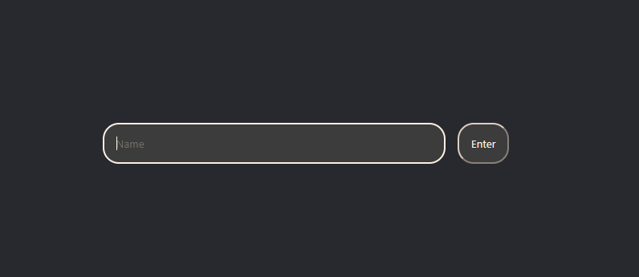

# React Chat App
This lab will reinforce what we've covered about Typescript and React

## Setup 

In one terminal, run `npm run dev` to start the chat server.  
In another, run `npm start` to start webpack and the react development server.

Use `src\chat\ChatShell.tsx` as a starting point to build out your application. 

 

## Goals 

Implement the chat app by following good component architecture and using state management where necessary. 

Feel free to style it however you want, using css files. 
Follow the example for the `ChatShell.tsx` and `ChatShell.css` on how to set them up.
However, it does not have to be pretty. 

## Example
### Login Screen

### Chat Interface

